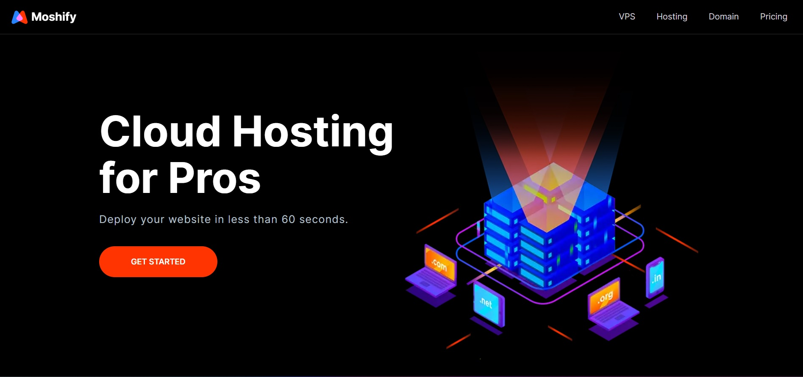

# Moshify - Cloud Hosting for Pros by Caltron

This is a course project for [The Ultimate HTML/CSS Mastery Series](https://codewithmosh.com/p/the-ultimate-html-css-part3) on [Mosh - Coding Made Simple](https://codewithmosh.com/).

## Table of contents

- [Overview](#overview)
  - [Screenshot](#screenshot)
- [My process](#my-process)
  - [Built with](#built-with)
- [Author](#author)
- [Acknowledgments](#acknowledgments)

## Overview

### Screenshot

### Links

- Solution URL: [https://github.com/caltron-xo/moshified](https://github.com/caltron-xo/moshified)
- Live Site URL: [https://moshified-by-caltron.netlify.app/](https://moshified-by-caltron.netlify.app/)

## My process

### Built with

- Semantic HTML5 markup
- CSS custom properties
- Flexbox
- CSS Grid
- Mobile-first workflow
- [AOS](https://michalsnik.github.io/aos/) - Animate On Scroll Library

## Author

- LinkedIn - [Rajdeep Singha](https://www.linkedin.com/in/rajdeepsingha/)
- Frontend Mentor - [@caltron-xo](https://www.frontendmentor.io/profile/caltron-xo)
- GitHub - [@caltron-xo](https://github.com/caltron-xo)

## Acknowledgments

Cheers to Mosh Hamedani for this fun, highly-practical, step-by-step course that teaches how to build and deploy fast, stunning websites using a systematic approach.
